# Bitkong Simulator

My project is a simulator one of the game in online casino game Bitkong. The goal of this project is to provide users with an authentic experience of playing Bitkong in a virtual environment. 
With this project, users can enjoy playing Bitkong without leaving their homes. The main features of the project include the ability to play Bitkong, display graphical elements of the game, and process the results. We have also added some unique features such as enhanced graphical effects and additional bonuses to make the gameplay even more engaging.

## Diagrams

In this section, you will find the conceptual diagram and logical diagram that describe the architecture and logic of our project:
1. Conceptual Diagram - This diagram presents the overall concept and structure of the project, showing the key components and their interactions.
2. Logical Diagram - This diagram provides a more detailed description of the logic and interactions of the project's components.

### [Conceptual Diagram](#conceptual)

### [Logical Diagram](#logical)

```mermaid
erDiagram
    user ||--o{ game : plays
    game ||--|{ game_step : has
    user ||--o{ client_seed : has
    user ||--o{ server_seed : has
    client_seed ||--o{ game : uses
    server_seed ||--o{ game : uses
    game ||--o| topwin : is
    game }|--o| currency : has
    game }o--|| game_difficulty : has
    user ||--o{ account : has
    account }o--|| currency : in
    account ||--o{ transaction : has 
    user {
        int id PK
        char(60) password
        varchar username
        varchar email
        datetime last_visit
        datetime date_create
        datetime date_update
    }
    client_seed {
        int id PK
        int user_id FK
        varchar(32) value
        datetime date_create
    }
    server_seed {
        int id PK
        int user_id FK
        char(64) value
        int nonce
        datetime date_reveal
        datetime date_create
    }
    game {
        int id PK
        int user_id FK
        int client_seed_id FK
        int server_seed_id FK
        int currency_id FK
        int game_difficulty_id FK
        int nonce
        int bet
        decimal base_currency_exchange_rate
        decimal prize
        decimal coefficient
        smallint step
        enum status
        datetime date_start
        datetime date_end
    }
    game_step {
        int game_id PK
        smallint step PK
        jsonb result
        smallint selected
        datetime date_selected
    }
    game_difficulty {
        int id PK
        varchar name
        decimal coefficient
    }
    topwin {
        int game_id FK
        decimal prize
        datetime date_create
        datetime date_update
    }
    account {
        int id PK
        int user_id FK
        int currency_id FK
        decimal balance
        datetime date_create
        datetime date_update

    }
    currency {
        int id PK
        char(3) iso_code
        decimal base_currency_exchange_rate
    }
    transaction {
        int id PK
        int account_id
        decimal summ
        enum type
        datetime date_create
    }
```

